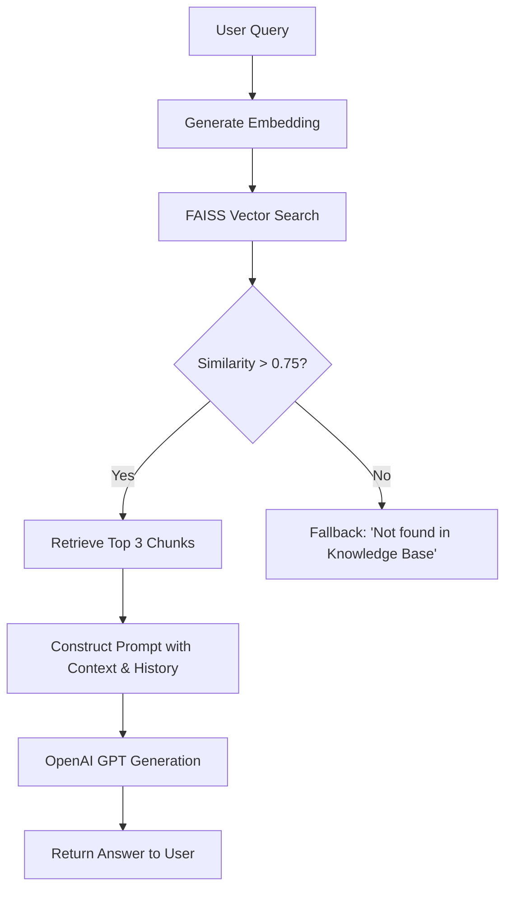

# RAG Chatbot Application

A complete production-grade Retrieval-Augmented Generation (RAG) chatbot application.

## Features
- Real document embedding with OpenAI `text-embedding-3-small`.
- Vector similarity search using FAISS with cosine similarity.
- Grounded generation using `gpt-4o-mini`.
- Similarity thresholding to prevent hallucinations.
- Session-based conversation memory backed by SQLite.
- Fully responsive vanilla HTML/CSS/JS frontend.
- Production-ready FastAPI backend.

## Tech Stack
- **Backend:** FastAPI, Python 3.10+, SQLAlchemy (SQLite)
- **AI/ML:** OpenAI API, FAISS, tiktoken, scikit-learn, numpy
- **Frontend:** HTML, CSS, JavaScript (Vanilla)

## RAG Architecture
1. **Ingestion**: Documents are chunked (400 tokens, 50 overlap) and embedded. Stored in FAISS index.
2. **Retrieval**: User query is embedded, and Top-K (K=3) most similar chunks are retrieved using Cosine Similarity (Inner Product of normalized vectors).
3. **Thresholding**: Chunks below a 0.75 similarity score are rejected.
4. **Generation**: If context exists, it is combined with conversation history and passed to the LLM. If no context meets the threshold, the system responds safely.

## Workflow Diagram


## Installation & Setup

1. **Clone & Environment**:
    ```bash
    python -m venv venv
    source venv/bin/activate  # on Windows: venv\Scripts\activate
    pip install -r requirements.txt
    ```

2. **Environment Variables**:
    Create a `.env` file in the root based on `.env.example`:
    ```env
    OPENAI_API_KEY=your_key_here
    ```

3. **Running the Backend**:
    ```bash
    uvicorn app.main:app --reload
    ```
    The FAISS index will be built on the first run from `data/docs.json`.

4. **Running the Frontend**:
    Serve the `frontend` directory using any static file server:
    ```bash
    cd frontend
    python -m http.server 8080
    ```
    Visit `http://localhost:8080`.

## API Endpoints
- `POST /api/chat`: Submit a message.
- `GET /health`: Health check.

## Embedding and Prompt Strategy
We use `text-embedding-3-small` due to its high efficiency and quality. Overlapping chunks ensure no context is lost at chunk boundaries.
The Prompt strictly commands the LLM to *only* use provided context, practically eliminating hallucinations.

## Deployment
This project includes a `render.yaml` for zero-config deployment to Render.
